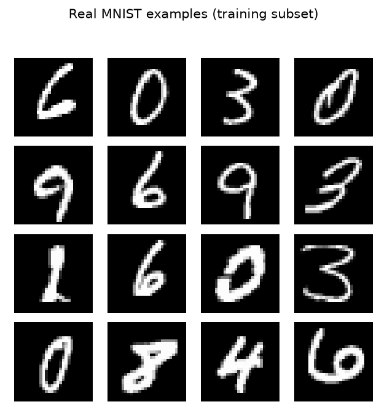
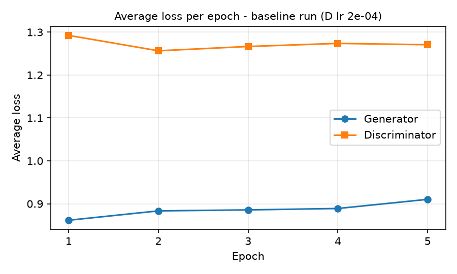
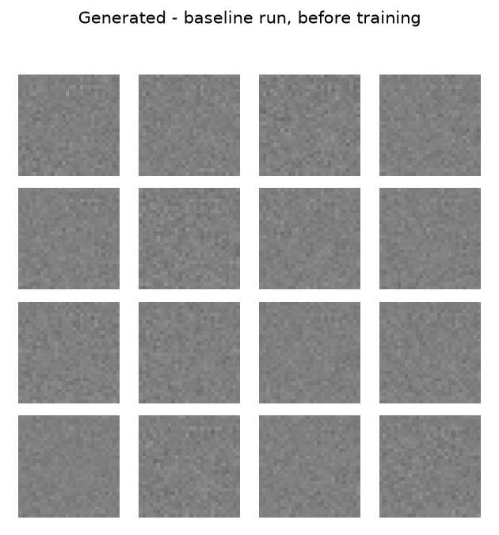
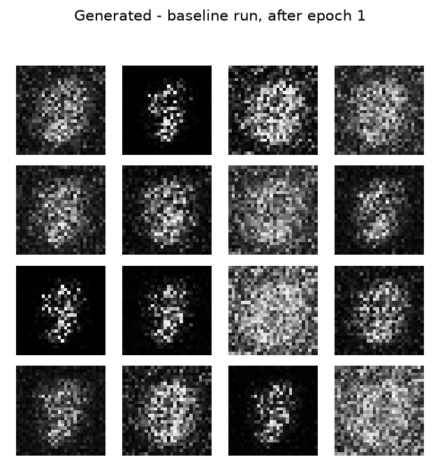
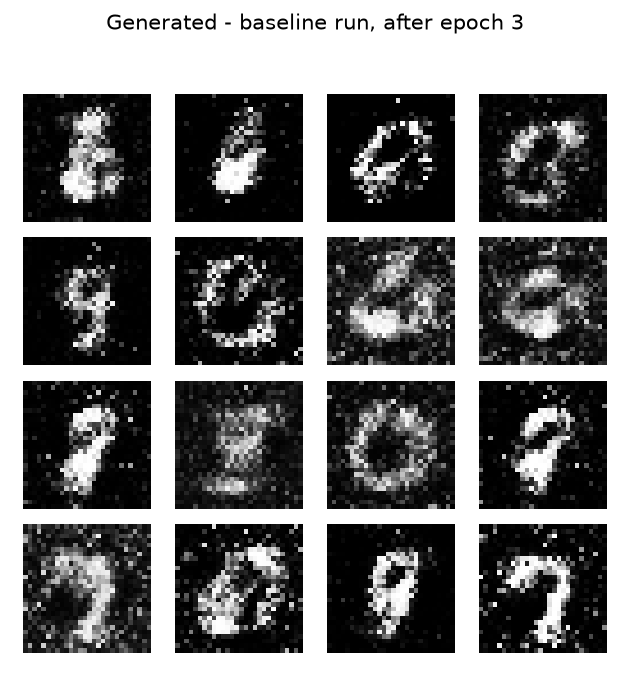
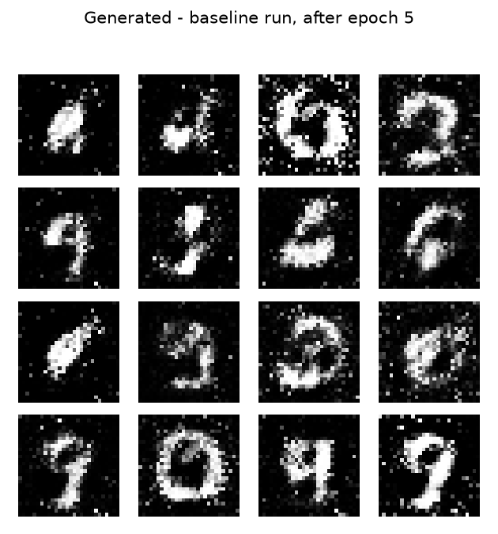
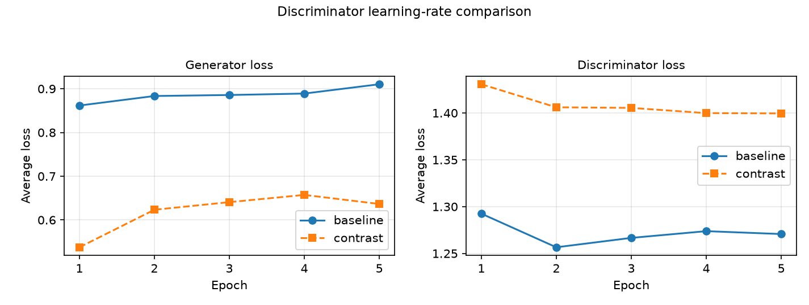
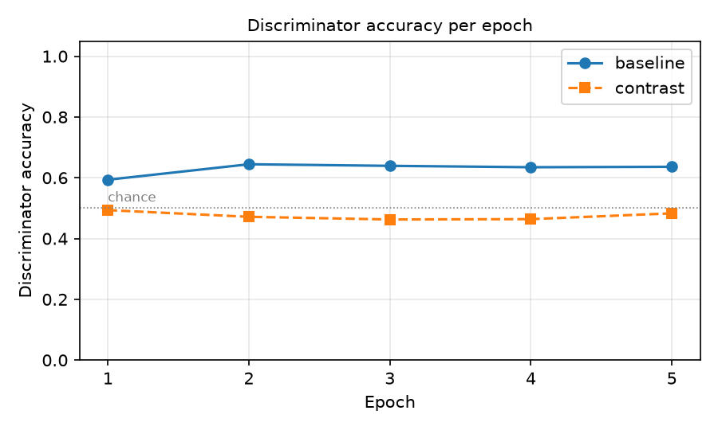
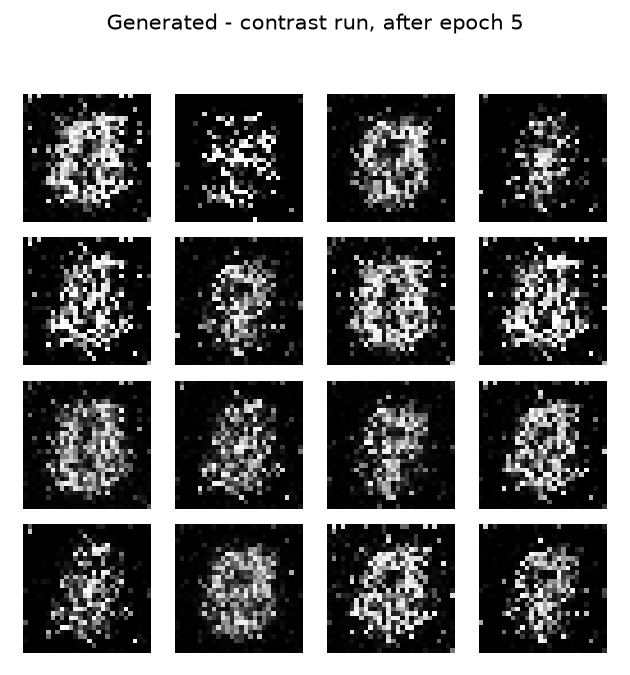

# Generating Handwritten Digits with a GAN

**Samuel Collins** - Ph.D. Student, Department of Cyber-Physical Systems, Clark Atlanta University
samuel.collins@students.cau.edu

Computer Vision - Lab Assignment 5: Generative Adversarial Networks - Instructor: Dr. Kishor Datta Gupta - 2026-09-29

Repository: https://github.com/srcollins785/Samuel_Collins_GAN_MNIST

---

## Summary

**The run with the lower final generator loss produced the worse images.** The contrast run ended at a generator loss of 0.6365 against 0.9104 for the baseline run, a gap of 0.2738, and its samples are visibly the poorer of the two: speckled clouds rather than the digit strokes the baseline run reached by the same epoch. The generator loss and the sample quality moved in opposite directions, which is the central observation this report is built around.

An unconditional fully connected GAN was trained on a reproducible 10,000-image subset of the MNIST training split (checksum `0a1b4f46cd55`) for 5 epochs at batch size 32, which is 1,560 generator updates. The experiment was then repeated from scratch with the discriminator learning rate changed from 2e-4 to 2e-5 and nothing else altered. Both runs used the same sixteen evaluation noise vectors (checksum `dcf03d6f6db5`) at every checkpoint. Total training time 14.8 s on Apple M4 Max.

Every table, figure and number in this report was generated from the saved run files by `scripts/generate_report.py`. No number here was typed by hand. `scripts/validate_results.py` audits those files for internal consistency, including that the two run configurations differ in the discriminator learning rate and in no other field.

## 1. Data and configuration

MNIST's 60,000-image training split was reduced to a 10,000-image subset by `numpy.random.default_rng(seed).choice, without replacement, sorted` at seed 42. The images themselves are not in the repository - the brief forbids submitting dataset downloads - so what is committed is `data/subset_manifest.json`: the indices, the seed and a checksum over them. `scripts/build_mnist_subset.py` rebuilds the subset from it, and both runs recorded the same checksum `0a1b4f46cd55`, which is checked rather than assumed.

Images are kept at 28 x 28 and normalized ToTensor to [0, 1], then (x - 0.5) / 0.5 to [-1, 1]. The range matters: the generator ends in `tanh`, so it can only emit values in [-1, 1]. Real data in [0, 1] would leave half the generator's range unusable and let the discriminator separate real from generated on brightness alone.

Digit labels are not an input anywhere. This is an unconditional GAN: the generator's only input is a 100-dimensional vector of independent standard normals.



*Figure 1. Sixteen real examples from the training subset.*


### Recorded configuration

`configuration.yaml` is generated from the run files by `scripts/write_configuration.py`, so it records what ran rather than what was intended. The settings are tabulated in Section 4 alongside the comparison.

## 2. The two networks

### Generator

**Generator** - input `(100,)`, 1,489,424 parameters, all trainable

| Layer | Type | Output shape | Parameters |
|---|---|---|---|
| `net.0` | Linear | `(256,)` | 25,856 |
| `net.1` | LeakyReLU | `(256,)` | 0 |
| `net.2` | Linear | `(512,)` | 131,584 |
| `net.3` | BatchNorm1d | `(512,)` | 1,024 |
| `net.4` | LeakyReLU | `(512,)` | 0 |
| `net.5` | Linear | `(1024,)` | 525,312 |
| `net.6` | BatchNorm1d | `(1024,)` | 2,048 |
| `net.7` | LeakyReLU | `(1024,)` | 0 |
| `net.8` | Linear | `(784,)` | 803,600 |
| `net.9` | Tanh | `(784,)` | 0 |

### Discriminator

**Discriminator** - input `(1, 28, 28)`, 533,505 parameters, all trainable

| Layer | Type | Output shape | Parameters |
|---|---|---|---|
| `net.0` | Flatten | `(784,)` | 0 |
| `net.1` | Linear | `(512,)` | 401,920 |
| `net.2` | LeakyReLU | `(512,)` | 0 |
| `net.3` | Dropout | `(512,)` | 0 |
| `net.4` | Linear | `(256,)` | 131,328 |
| `net.5` | LeakyReLU | `(256,)` | 0 |
| `net.6` | Dropout | `(256,)` | 0 |
| `net.7` | Linear | `(1,)` | 257 |

### What each one is for

The **generator's input** is noise and nothing else: a 100-dimensional latent vector drawn from a standard normal. It carries no information about digits. Everything the samples eventually show - stroke thickness, closed loops, the fact that ink sits in the middle of the frame - is stored in the generator's weights and is reached by gradient descent, not supplied at inference. The output is a 1 x 28 x 28 image bounded to [-1, 1] by `tanh`.

The **discriminator's target** is a single real-or-generated decision, not a digit class. It receives an image and returns one unbounded score. It is trained on labels that describe the image's provenance, which the data supplies for free: anything from the MNIST subset is real, anything the generator just produced is not.

**The objectives differ because the two networks want opposite things from the same number.** The discriminator wants its score to be high on real images and low on generated ones. The generator wants that same score to be high on its own output. They share one scalar and pull it in opposite directions, so neither has a loss it can minimize alone: the discriminator's task gets harder exactly as the generator improves. This is why neither loss curve can be read the way a classifier's training loss is read - a falling generator loss may mean the generator improved, or that the discriminator got worse, and the number alone does not say which. Section 5 shows a case where it was the second.

### Loss formulation

The discriminator's final layer is `Linear(256, 1)` with no sigmoid, so it returns a **logit**. The loss is `BCEWithLogitsLoss`, which applies the sigmoid inside the loss and evaluates it in log space. The brief asks that the binary cross-entropy formulation be consistent with whether the discriminator returns logits or probabilities, and this is that consistency. Pairing a raw logit with plain `BCELoss` would be wrong; pairing an explicit sigmoid with `BCEWithLogitsLoss` would apply the sigmoid twice. `tests/test_models.py` asserts the output escapes [0, 1] on extreme inputs, which a probability could not.

The generator's target is 1, not 0. It maximizes the probability that its own output is called real rather than minimizing the discriminator's success. This non-saturating form gives the generator a strong gradient exactly when it is losing badly, which is when it most needs one.

## 3. The training updates

Each batch runs one discriminator step and then one generator step. Which parameters move in each is the part of the assignment with the most weight on it, so it is stated here and asserted in the tests.

**Discriminator step** - updates the discriminator only. The real batch is scored against a target of 1 and the generated batch against 0. The generated batch is passed as `fake.detach()`, which severs the graph so no gradient reaches the generator at all. The optimizer holds discriminator parameters only, so even a gradient that did arrive could not be applied.

**Generator step** - updates the generator only. The *non-detached* `fake` is scored by the discriminator against a target of 1, so backward runs through the discriminator and into the generator: the path is preserved, which is what lets the generator learn from how it was scored. The discriminator accumulates gradients during that traversal and they are never applied, because this optimizer holds generator parameters only and the next discriminator step zeroes them before it starts.

These are two independent guarantees - the detach and the optimizer partition - and `tests/test_train.py` checks both by snapshotting every parameter of the network that should hold still, running the other network's step, and comparing. Removing the `.detach()` fails five of those tests rather than passing quietly, which was verified deliberately: a test that cannot fail establishes nothing.

## 4. Baseline run

Discriminator learning rate 2e-4, equal to the generator's, which is the pairing the TensorFlow DCGAN tutorial uses. 5 epochs, 312 batches each, 7.1 s on mps.

### Per-epoch losses

| Epoch | Generator loss | Discriminator loss | D accuracy (real) | D accuracy (fake) | D accuracy | Time |
|---|---|---|---|---|---|---|
| 1 | 0.8617 | 1.2925 | 0.805 | 0.382 | 0.594 | 1.4 s |
| 2 | 0.8835 | 1.2566 | 0.740 | 0.549 | 0.644 | 1.2 s |
| 3 | 0.8858 | 1.2666 | 0.683 | 0.595 | 0.639 | 1.2 s |
| 4 | 0.8890 | 1.2738 | 0.658 | 0.612 | 0.635 | 1.5 s |
| 5 | 0.9104 | 1.2707 | 0.645 | 0.627 | 0.636 | 1.4 s |



*Figure 2. Average generator and discriminator loss per epoch, baseline run.*


### Fixed-noise checkpoints (before training, epoch 1, epoch 3, epoch 5)

The same sixteen noise vectors are used at every checkpoint, so what changes between these grids is the generator and nothing else.



*Figure 3.0. Baseline generator output, before training.*




*Figure 3.1. Baseline generator output, after epoch 1.*




*Figure 3.3. Baseline generator output, after epoch 3.*




*Figure 3.5. Baseline generator output, after epoch 5.*


## 5. The controlled comparison

The experiment was repeated from scratch with the discriminator learning rate changed from **2e-4** to **2e-5** - a factor of ten lower. The generator learning rate, architecture, data subset, batch size, epoch budget, initial random seed and fixed evaluation noise are unchanged.

That claim is checked, not asserted. `scripts/validate_results.py` diffs the two saved configurations against a list of fields the comparison holds fixed and fails unless the discriminator learning rate is the only one that moved, and unless the evaluation-noise checksum is identical across every checkpoint of both runs.

### Settings and runtime

| Setting | Baseline | Contrast |
|---|---|---|
| Discriminator learning rate | **2e-4** | **2e-5** |
| Generator learning rate | 2e-4 | 2e-4 |
| Optimizer | Adam (0.5, 0.999) | Adam (0.5, 0.999) |
| Random seed | 42 | 42 |
| Training images | 10,000 | 10,000 |
| Subset checksum | `0a1b4f46cd55` | `0a1b4f46cd55` |
| Batch size | 32 | 32 |
| Batches per epoch | 312 | 312 |
| Epochs | 5 | 5 |
| Generator updates | 1,560 | 1,560 |
| Latent dimension | 100 | 100 |
| Evaluation noise checksum | `dcf03d6f6db5` | `dcf03d6f6db5` |
| Device | mps | mps |
| Runtime | 7.1 s | 7.7 s |
| Final generator loss | 0.9104 | 0.6365 |
| Final discriminator loss | 1.2707 | 1.3995 |
| Final discriminator accuracy | 0.636 | 0.483 |

### Per-epoch losses, contrast run

| Epoch | Generator loss | Discriminator loss | D accuracy (real) | D accuracy (fake) | D accuracy | Time |
|---|---|---|---|---|---|---|
| 1 | 0.5375 | 1.4307 | 0.978 | 0.009 | 0.493 | 1.5 s |
| 2 | 0.6233 | 1.4061 | 0.883 | 0.060 | 0.472 | 1.4 s |
| 3 | 0.6407 | 1.4054 | 0.789 | 0.137 | 0.463 | 1.5 s |
| 4 | 0.6573 | 1.3998 | 0.698 | 0.230 | 0.464 | 1.5 s |
| 5 | 0.6365 | 1.3995 | 0.803 | 0.163 | 0.483 | 1.6 s |



*Figure 4. Generator and discriminator loss for both runs.*




*Figure 5. Discriminator accuracy per epoch, both runs. The dotted line is chance.*


### Final grids


*Figure 6. Baseline run after epoch 5, discriminator learning rate 2e-4.*




*Figure 6. Contrast run after epoch 5, discriminator learning rate 2e-5.*


### What changed

The slower discriminator never became a useful critic. Its accuracy ended at 0.483, against 0.636 in the baseline, and its loss stayed near 1.400 - close to the 1.386 that two chance-level cross-entropy terms produce. A discriminator at chance cannot tell the generator which direction improves an image, so the generator optimized against an uninformative signal and produced texture rather than strokes.

The generator's loss fell anyway, to 0.6365 from the baseline's 0.9104. Fooling a weak discriminator is easy, and the loss measures exactly that.

### What this comparison can and cannot establish

**It can establish** that within this setup, at this seed and this budget, lowering the discriminator learning rate by a factor of ten degraded sample quality while lowering the generator's loss. The audit rules out a second uncontrolled difference as the cause, and the identical evaluation noise rules out the grids differing because different vectors were drawn.

**It cannot establish** a general relationship. It is two points on one axis, at one seed, at one architecture, after 1,560 generator updates. It says nothing about whether the trend continues, reverses, or is an artifact of such a short budget, and nothing about any rate between or beyond the two tested. It also measures quality by eye: there is no quantitative sample-quality score here, so "worse" is a visual reading of sixteen images, not a metric.

The next section addresses the first two of those gaps directly, because both were cheap enough to test that leaving them untested would have been a choice.

## 6. Supplementary evidence

Neither of these is the comparison the brief requires. Both are reported because the required comparison has limits that were cheap to probe, and because two of the four rates below moved the opposite way from the chosen contrast - leaving them out would make the comparison look more conclusive than it is.

### A four-rate sweep at one seed

| Discriminator lr | Generator loss | Discriminator loss | D accuracy |
|---|---|---|---|
| 2e-5 (contrast) | 0.6365 | 1.3995 | 0.483 |
| 2e-4 (baseline) | 0.9104 | 1.2707 | 0.636 |
| 1e-3 | 0.9869 | 1.2157 | 0.667 |
| 4e-3 | 0.9324 | 1.4591 | 0.573 |

Generator loss is lowest at 2e-5 (0.6365) and highest at 1e-3 (0.9869). Judged visually, the sample quality runs the other way across that range: the 2e-5 grid is the speckled one and the faster discriminators produced the cleaner strokes. The pattern is not open-ended - at 4e-3 the discriminator loss oscillates between epochs rather than settling, which is the instability a discriminator that is too fast is expected to produce, even though its samples at five epochs were still sharp. The sweep grids are in `plots/supplementary/`.

### Each arm repeated at three seeds

| Arm | Discriminator lr | Seed | Generator loss | D accuracy |
|---|---|---|---|---|
| baseline | 2e-4 | 42 | 0.9104 | 0.636 |
| baseline | 2e-4 | 43 | 0.9141 | 0.640 |
| baseline | 2e-4 | 44 | 0.8974 | 0.629 |
| contrast | 2e-5 | 42 | 0.6365 | 0.483 |
| contrast | 2e-5 | 43 | 0.6711 | 0.482 |
| contrast | 2e-5 | 44 | 0.6372 | 0.480 |

The gap between the two arms in final generator loss is 0.2590. The largest spread within a single arm across its three seeds is 0.0345. The arms are therefore separated by roughly 8 times the seed-to-seed variation, so the difference is not an artifact of one initialization. This addresses the seed objection to the required comparison; it does not address the two-point objection, which would need rates between the ones tested.

## 7. Analysis

<!-- analysis:start -->

**Quality and variety across checkpoints.** Before training the grid is structureless noise. After epoch 1 the sixteen samples are diffuse grey clouds centered in the frame: the generator has learned where ink belongs before it has learned what ink looks like. Epoch 3 is where strokes appear - several closed loops in the middle rows - against backgrounds that are still visibly speckled. By epoch 5 the strokes are continuous and the backgrounds are largely black: the third-row ring and fourth-row oval read as zeros, two right-column samples as nines. Several remain ambiguous blobs, and none would pass as clean handwriting. That is the expected outcome of 1,560 generator updates, not a failure.

**Do repeated outputs suggest mode collapse?** The baseline grid leans heavily toward round, closed forms - zeros, sixes and nines - and thin digits like 1 and 7 are underrepresented. That is consistent with partial mode collapse. The evidence does not support the diagnosis, though. The sixteen samples are not duplicates of each other: stroke thickness, loop size and slant all vary between them, which outright collapse would not permit. More importantly, sixteen vectors are far too small a sample to characterize the output distribution, and round digits may simply be what a five-epoch generator learns first. Distinguishing the two needs a classifier over a few thousand samples to measure the class histogram, which was outside this lab's scope.

**Why a low generator loss is not enough.** This run answers the question with its own evidence. The contrast generator ended at 0.6365, well below the baseline's 0.9104, and produced visibly worse images. The reason is that the generator's loss is measured against the current discriminator, and the contrast discriminator was barely better than chance: accuracy 0.483 and a loss of 1.400, near the 1.386 that two chance-level terms give. A low generator loss against a weak critic says the critic is weak. The same argument inverts for discriminator accuracy: the baseline's 0.636 does not make its generator poor, and a discriminator that had memorized the subset could score near 1.0 while teaching the generator nothing. Both numbers describe the contest, not the images.

**The learning-rate change, and what to test next.** Lowering the discriminator rate tenfold removed the training signal the generator depends on and degraded the samples while improving its loss. A three-seed replication puts the gap between the arms at 0.2590 against a within-arm spread of 0.0345, so this is not one unlucky initialization. Next I would run intermediate rates to find where quality stops improving, extend the budget well past five epochs to see whether the fast-discriminator advantage survives, and replace the visual judgment with a quantitative score - Frechet Inception Distance, or a classifier-based class histogram - so that "better" stops depending on my reading of sixteen pictures.

**An application, and a limitation to check.** Synthetic images are useful for augmenting rare classes in a detection or classification training set - defect types that appear a few times a year on a production line, for instance, where real examples are too scarce to train on. The limitation I would check first is whether the generator covers the real variation or only its dense center. A generator with the mode bias suggested above would manufacture many typical examples and none of the unusual ones, and a model trained on that augmented set would look better in validation while getting worse at exactly the rare cases the augmentation was meant to fix.

<!-- analysis:end -->

## 8. Source and changes

The starting point was the official TensorFlow DCGAN tutorial (<https://www.tensorflow.org/tutorials/generative/dcgan>), which the brief cites as a worked MNIST example. What was taken from it: the overall alternating-update structure, the separate real and fake discriminator loss terms summed into one discriminator loss, the non-saturating generator objective with a target of 1, Adam at beta-1 0.5, a learning rate of 2e-4 for both networks, tanh output with data scaled to [-1, 1], and the practice of rendering a fixed noise vector at intervals to watch progress.

What was changed, and why:

- **PyTorch rather than TensorFlow.** The brief permits either. The   requirement to show that the discriminator step does not update   the generator is more directly expressible - and more directly   testable - with explicit optimizers and `.detach()` than with a   gradient tape.
- **Fully connected rather than convolutional.** The brief states a   small fully connected GAN is sufficient. It also trains in seconds   at this budget, which made the four-rate sweep and the three-seed   replication in Section 6 affordable.
- **`BCEWithLogitsLoss` on a logit output** rather than the   tutorial's `from_logits=True` cross-entropy, which is the same   formulation in PyTorch's vocabulary.
- **Batch size 32 rather than 256.** See Section 9.
- **A 10,000-image subset, 5 epochs**, as the brief specifies, rather   than the tutorial's full 60,000 for 50 epochs.

## 9. Documented choices and deviations

**Batch size 32.** The brief fixes the subset at 10,000 images and the budget at 5 epochs but does not fix the batch size, and that choice determines how many times the generator is actually updated: 390 at batch 128 against 1,560 at batch 32. A scouting run at batch 128 produced centered blobs at five epochs where batch 32 produced recognizable strokes; batch 16 was no better and twice as slow. The choice is recorded here rather than presented as a default.

**The standard compute path was used.** The brief offers a reduced option of 5,000 images and 3 epochs for limited hardware. It was not needed: the full 10,000-image, 5-epoch run takes 7.1 s.

**Scouting runs preceded the final ones.** Four discriminator rates were tried before choosing the contrast value, and all four are reported in Section 6 rather than only the one chosen. The contrast rate was selected because it produced the clearest result, not because it was the only one tried, and two of the four moved the opposite way.

**Sample quality is judged visually.** No FID or classifier-based score was computed. Every claim about images being better or worse in this report is a reading of a sixteen-image grid and should be treated as such.

**Device.** MPS was used after measuring it at 2.1 s against 2.8 s for CPU over five epochs. The subset selection uses NumPy and the noise is drawn on the CPU before being moved to the device, so neither the data nor the evaluation grid depends on which device ran.

## 10. Reproducing this report

```
python3.12 -m venv .venv
.venv/bin/python -m pip install -r requirements.txt
.venv/bin/python scripts/run_all.py
```

`run_all.py` runs the test suite, builds the subset, runs both experiments and the supplementary runs, audits the results, regenerates this report and its PDF, and executes the notebook. Each step is a separate script and can be run alone; the experiments take 14.8 s and the report takes about a second, and it is usually the report that changed.

Executed notebook: `GAN_MNIST.ipynb`. Repository: https://github.com/srcollins785/Samuel_Collins_GAN_MNIST.
